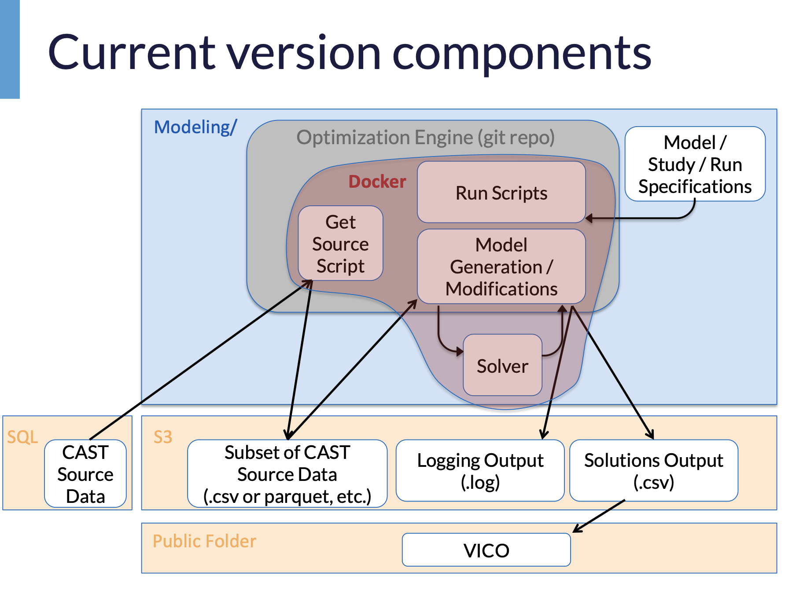
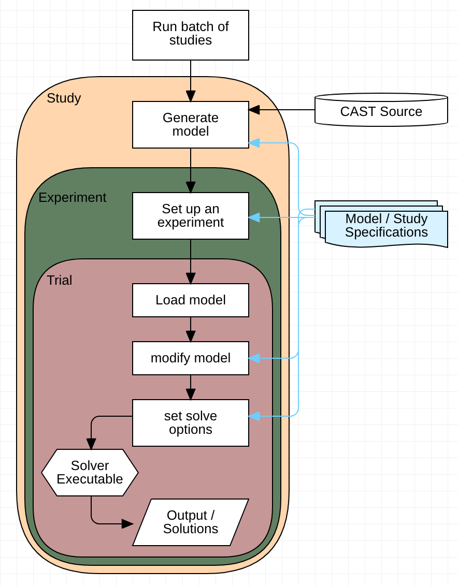

# BayOTA

BayOTA (Bay Optimization Tools for Analysis) is designed for use by the partners of the
Chesapeake Bay Program (CBP) as well as the general public as part of the Optimization Tool
Development Project (EPA-R3-CBP-16-03).
Specifically, this extends the functionality of -
and helps users of - CAST (the Chesapeake Bay Assessement Scenario Tool),
which is the CBP Phase 6 time-averaged watershed model.

<strong>Table of Contents</strong>

* [How do I get set up?](#-how-do-i-get-set-up)
    1. [Ensure the IPOPT solver is installed and in $PATH](#1-ensure-the-ipopt-solver-is-installed-and-in-path)
    2. [Clone the repository](#2-clone-the-repository)
    3. [Configure before installing](#3-configure-before-installing)
    4. [Install packages](#4-install-packages)
    5. [Double-check the local paths](#5-double-check-the-local-paths)
    6. [Test the installation](#6-test-the-installation)
* [Usage](#-usage)
    - [Specification Files](#specification-files)
    - [From the command line](#1-from-the-command-line)
    - [From the python prompt](#2-from-the-python-prompt)
    - [From a jupyter notebook](#3-from-a-jupyter-notebook)
    - [Cleaning up after installation and runs](#-cleaning-up-after-intallation-and-runs)
* [Uninstall](#-uninstall)
* [Other Notes](#-other-notes)
* [Debugging or troubleshooting](#-debugging-or-troubleshooting)
* [Project structure](#-project-structure)
    - [Components](#components)
    - [Run Sequence](#run-sequence)
    - [Directory Tree](#directory-tree)
* [Credits](#-credits)
* [Disclaimer](#-disclaimer)
* [License](#-license)
* [Who do I talk to?](#-who-do-i-talk-to)

# ⚙ How do I get set up?

#### 1📉 Ensure the IPOPT solver is installed and in $PATH

-- The Ipopt solver must be compiled/installed separately in order to solve Efficiency BMP optimization problems.
- Instructions can be found at https://www.coin-or.org/Ipopt/documentation/node14.html
- After installation, the Ipopt executable location must be added to the environment $PATH variable


#### 2👥 Clone the repository

-- Check out a clone of this repository to a location of your choice, e.g.
```
git clone https://gitlab.com/daka42/bayota.git ~/bayota
```

-- From the project directory, get the latest version:

```
cd bayota/

git pull
```

#### 3🏡 Configure before installing

***Note:*** *Important filepaths are set (during install) by the `bayota_settings` package.\
These paths include general output, logging, temporary files, etc., and are defined in the following three config files:*

- `bash_config.con` *specifies the path of the project directory.*
- `logging_config.yaml` *specifies the format and targets of log messages.*
- `user_config.ini` *specifies output path stems (for stdout, graphics, and logs)*

*These three config files are required for conducting BayOTA optimization studies, and will be copied into `~/bayota_ws_{version}/config/` during the first install (or first test run).*

*These files will not be programmatically changed by subsequent code executions after being generated.*\
*The example/default config files can be found in the `bayota_settings` package.*

-- Customize the following values in `bayota_settings/install_config.ini`:
- `project_home`
- `repo_top`


#### 4💾 Install packages

-- From the project dir (`bayota/`), enter:

```
pip install .
```


#### 5🛣️ Double check the local paths

During the first install (or first test run), default configuration files are generated.\
-- In `bayota_ws_{version}/config/`, customize values within:

- `user_config.ini` to direct output to the desired directories.\
- `bash_config.con` to specify the project home.


#### 6✅ Test the installation

-- From the project directory, run the automated test suites:

***(Note, these are currently out-of-sync with the packages, so will fail)***

```
cd bayota/

python castjeeves/setup.py test

python efficiencysubproblem/setup.py test
```

***Note:*** *Tests can be run from the project directory (`bayota/`) even though they are located within each package.\
If you try to run `python setup.py test` from the project dir directly, you will get an error message like:\
"no tests specified at the top(bayota package)-level".*

***Note:*** *To remove the test files after running the tests, use `python setup.py clean`.*

-- **If the tests pass, you should be good to go!**

# ▶ Usage

Optimization studies can be conducted in BayOTA in multiple ways:
1) Command-line: batch mode or single run
2) Python prompt: batch or single run
3) Jupyter notebook: batch or single run

#### Specification Files
Typical usage requires setting up model and run configurations in 'specification files'. 
These are defined in `bayota/bin/specification_files/`, and there are 3 types:
* **batch specs** - These set up one or more studies, by specifying:
    - geographies
    - names of model and experiment spec files to use
    - other options, such as moving/translating solution files after solving
* **model specs** - These set up the model objectives/constraints
* **experiment specs** - These allow modification of the model for particular experiments and running through different values of constraints.

#### 1⌨ From the command line
-- First, change directory to the project root (`cd bayota/`).

Five 'run' scripts are provided.  They provide the ability to run a batch of optimization studies automatically, \
or with individual steps run separately. They are, in order of their automated execution during a batch submission:
1) `run_step0_batch_of_studies.py`
2) `run_step1_single_study.py`
3) `run_step2_generatemodel.py`
4) `run_step3_conductexperiment.py`
5) `run_step4_solveonetrial.py`

###### Batch runs are set up using 'specification files'. These can be found in `bayota/bin/specification_files`.

-- Example command for a batch of studies:
* `-d` (or `--dryrun`) argument can be included to only print the commands that would be submitted without running them
* `--no_slurm` argument needed when not using the SLURM job manager
* `--help` for command syntax

```
./bin/run_scripts/run_step0_batch_of_studies.py -n calvertMD_cost_and_load_objective_experiments.yaml --dryrun
```


#### 2🐍 From the python prompt
```python
from efficiencysubproblem.src.model_handling import model_generator
from efficiencysubproblem.src.solver_handling import solvehandler

# Create a model instance
model_spec_file = '/bayota/bin/specification_files/model_specs/costmin_total_Npercentreduction.yaml'
mdlhandler = model_generator.ModelHandlerBase(model_spec_file=model_spec_file,
                                              geoscale='county',
                                              geoentities='Perry, PA',
                                              savedata2file=False,
                                              baseloadingfilename='2010NoActionLoads_20190325.csv',
                                              log_level='INFO')
mdl = mdlhandler.model

# Set a constraint level
mdl.percent_reduction_minimum['N'] = 20

# Solve the instance and get results
solution_dict = solvehandler.basic_solve(modelhandler=mdlhandler, mdl=mdlhandler.model,
                                         translate_to_cast_format='True')
                                             
print("solving timestamp: %s      feasible: %s" %
      (solution_dict['timestamp'], solution_dict['feasible']))

solution_data_frame = solution_dict['solution_df']
```

#### 3📓 From a jupyter notebook
The approach to use in a notebook is the same as the python prompt.\
Some example notebooks are provided in the bin/jnotebooks/ directory.

### 🧹 Cleaning up after intallation and runs

--- To remove build files created by "`python setup.py install`" or to remove temporary files created in the project home during a run:

```
python setup.py clean
```

# 🚮 Uninstall

--- To uninstall the python packages from your environment (site-packages):

```
pip uninstall bayota
```

--- *(less common) To remove development version of package (i.e., remove it from easy-install.pth and delete the .egg-link)*

```
python setup.py develop --uninstall
```

--- To remove everything (uninstall the python packages and then delete the source directory):

```
pip uninstall bayota
rm -r bayota/
```

# 📔 Other Notes

To use pynumero package from Pyomo:
- `scipy` is required
- may need to run `conda install -c conda-forge pynumero_libraries` for ASL library

# 🐛 Debugging or troubleshooting

* Use `--log_level=DEBUG` to output the most verbose logging messages.

# 📁 Project Structure

#### Components



#### Run Sequence



#### Directory Tree
```
bayota
│
├── README.md              <- Top-level README for users/developers of this project.
├── CHANGELOG.md           <- Documentation of notable changes to this project
│
├── bin                    <- scripts (python, bash, slurm, jupyter notebooks) for running from the command-line and performing analyses
│   └── jnotebooks/
│   └── python_scripts/
│   └── run_scripts/
│   └── specification_files/
│
├── data                   <- source data CSVs, excel files
│
├── castjeeves             <- Python *PACKAGE* to access, query, and parse source data from the Chesapeake Bay Assessement Scenario Tool (CAST)
│   ├── __init__.py
│   └── ...
│
├── efficiencysubproblem   <- Python *PACKAGE* to solve optimization problem involving 'Efficiency' Best Management Practices (BMPs) of CAST
│   ├── __init__.py
│   └── ...
│
├── sandbox                <- Python *PACKAGE* for automated generation of valid BMP input files for use with CAST
│   ├── __init__.py
│   └── ...
│
├── bayota_settings        <- Python *PACKAGE* that configures directory paths (output, graphics, & logging). Contains example config files.
│   ├── __init__.py
│   └── ...
│
├── bayota_util            <- Python *PACKAGE* for utility methods that haven't yet found a home elsewhere
│   ├── __init__.py
│   └── ...
│
├── Dockerfile_37_multistage
├── LICENSE
├── MANIFEST.in
├── setup.py
├── VERSION
```

## 💕 Credits

Major dependencies:

* [Pyomo](https://www.pyomo.org/)
* [IPOPT solver](https://projects.coin-or.org/Ipopt)
* [AMPLPY](https://github.com/ampl/amplpy)
* [Pandas](https://pandas.pydata.org/)
* [NumPy](https://www.numpy.org/)

Funding Acknowledgment:

* U.S. EPA cooperative agreement under federal grant EPA-R3-CBP-16-03 - "Chesapeake Bay Optimization Tool Development"

## ❗ Disclaimer

This is a beta version of the Bay Optimization Tools for Analysis (BayOTA), in the process of being tested. It is provided on an “as is” and “as available” basis and is believed to contain defects. A primary purpose of this beta testing release is to solicit feedback on performance and defects. The Chesapeake Bay Program Office (CBPO) does not give any express or implied warranties of any kind, including warranties of suitability or usability of the website, its software, or any of its content, or warranties of fitness for any particular purpose.
All users of BayOTA are advised to safeguard important data, to use caution, and not to rely in any way on correct functioning or performance of the beta release and/or accompanying materials. CBPO will not be liable for any loss (including direct, indirect, special, or consequential losses) suffered by any party as a result of the use of or inability to use BayOTA, its software, or its content, even if CBPO has been advised of the possibility of such loss.
Should you encounter any bugs, glitches, lack of functionality, or other problems on the website, please let us know. We can be reached at e-mail address dkaufman@chesapeakebay.net. Your help in this regard is greatly appreciated!

## 🎓 License
The 3-Clause BSD License

## 📧 Who do I talk to?

* The U.S. EPA Chesapeake Bay Program
* Daniel E. Kaufman: dkaufman@chesapeakebay.net